```{r setup, include=FALSE}
knitr::opts_chunk$set(echo = TRUE, fig.align = "center")
```

## Outline

- Anouncements
- RNA-seq Analysis Workflow
    - Read Alignment
    - Differential Expression
- RNA-seq Tools
- Odyssey Fest
- Cheer for Experiences

## Anouncements

- Please do not share your code with fellow students via github, please make sure your repo is private.
- Please double check you have access to Odyssey and /n/stat115/. You will need it for homework 3, 4, and 5 (due 3/4). Please shoot me an email if you are not blessed with access to that.
- Start early early early on homework 3! 


## RNA-seq analysis workflow


## Fragment alignment
- [Star: ultrafast universal RNA-seq aligner](https://academic.oup.com/bioinformatics/article/29/1/15/272537)
    - Suffix array (SA) approach to leverage speed of binary searching
    - Requires an index (the SA) to be created prior to aligning

- [Salmon: fast and bias-aware quantification of transcript expression using dual-phase inference](https://www.ncbi.nlm.nih.gov/pmc/articles/PMC5600148/)
    - Pseudo-alignment concept to rapidly align reads
    - Reads are classified according to their *fragment equivalence class* 
    - (Optionally) removes sequencing biases and computes coverage via likelihood maximization
    - Similar in concept and result to [Near-optimal probabilistic RNA-seq quantification](https://www.nature.com/articles/nbt.3519)
    
## Star alignment
- Needs to be run on Odyssey HPC
- Takes several hours to complete (given an index)
- How do we do that again?

```{r, engine='bash',eval=FALSE}
#!/bin/bash
#SBATCH -N 1                   # Number of nodes
#SBATCH -n 10                  # Number of cores
#SBATCH -t 180                 # Runtime in minutes (0~10080)
#SBATCH -p general             # Partition
#SBATCH --mem=50000            # Total memory (varies across nodes)
#SBATCH -o star_%j.out         # Standard out goes to this file
#SBATCH -e star_%j.err         # Standard err goes to this file
#SBATCH --mail-type=END        # Email
#SBATCH --mail-user=YOUR_EMAIL

module load gcc/4.8.2-fasrc01 STAR/2.5.0c-fasrc02

STAR --genomeDir $GENOME \
     --readFilesIn $FASTQ1 $FASTQ2 \
     --outFileNamePrefix $OUTDIR/ \
     --outSAMprimaryFlag AllBestScore \
     --outSAMtype BAM SortedByCoordinate \
     --runThreadN 10 \
     --alignEndsType EndToEnd 

```

```{r, engine='bash',eval=FALSE}
sbatch STARalignment.sh
```

## Salmon tutorial
{width=96%}

## How to train your Salmon
{width=81%}

## Salmon tutorial
{width=96%}

## Salmon tutorial
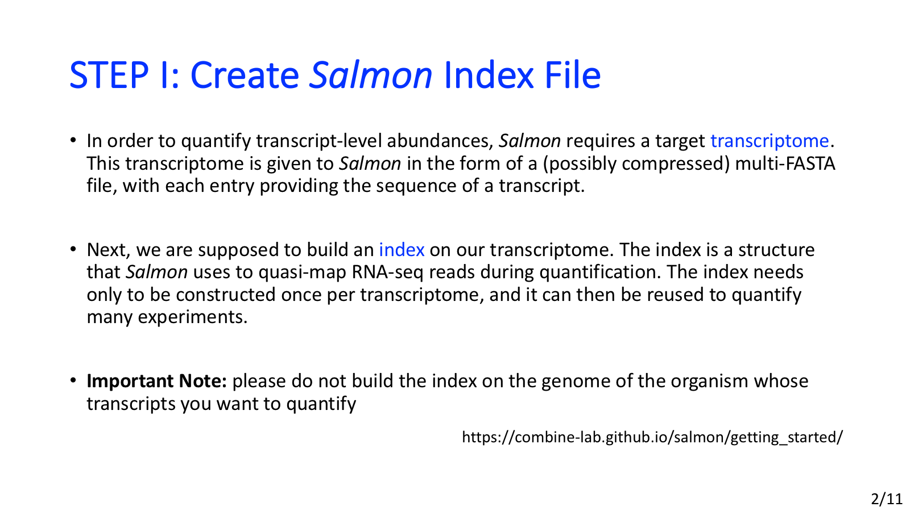{width=96%}

## Salmon tutorial
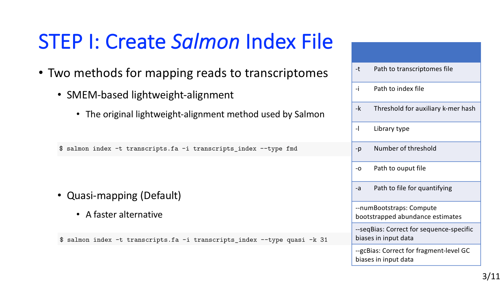{width=96%}


## Salmon tutorial
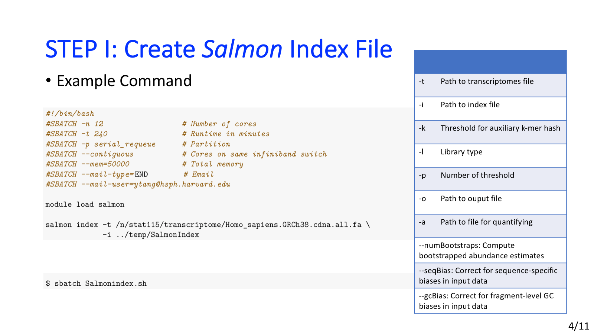{width=96%}

## Salmon tutorial
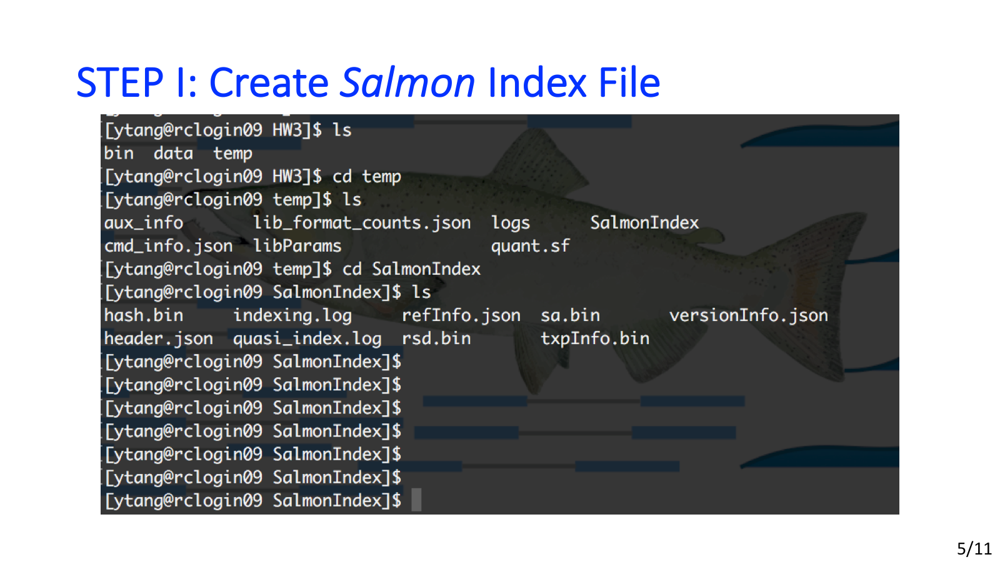{width=96%}


## Salmon tutorial
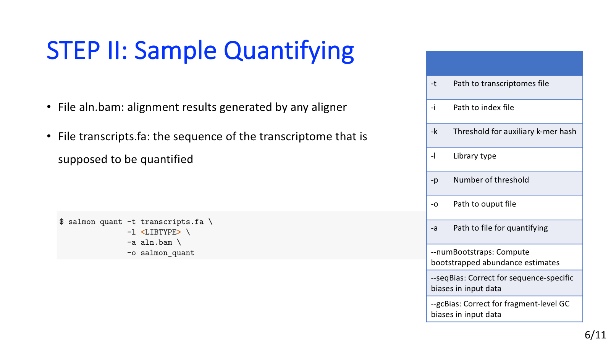{width=96%}

## Salmon tutorial
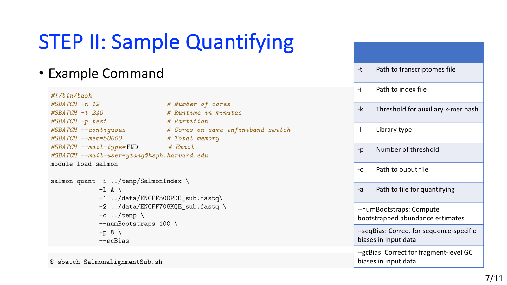{width=96%}


## Salmon tutorial
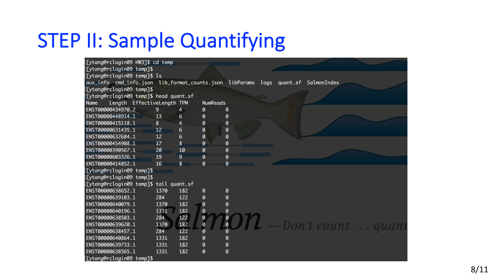{width=96%}

## Salmon tutorial
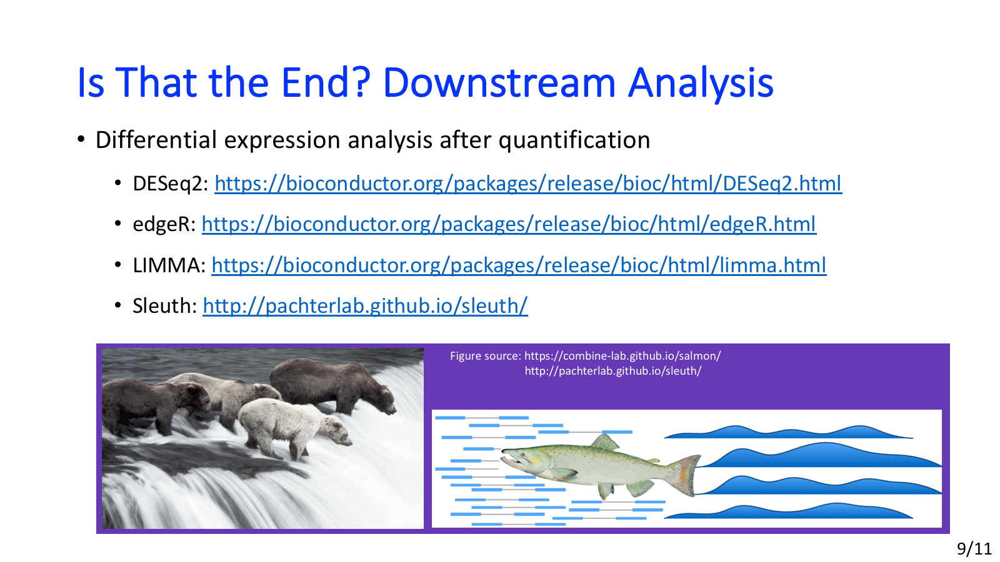{width=96%}


## Salmon tutorial
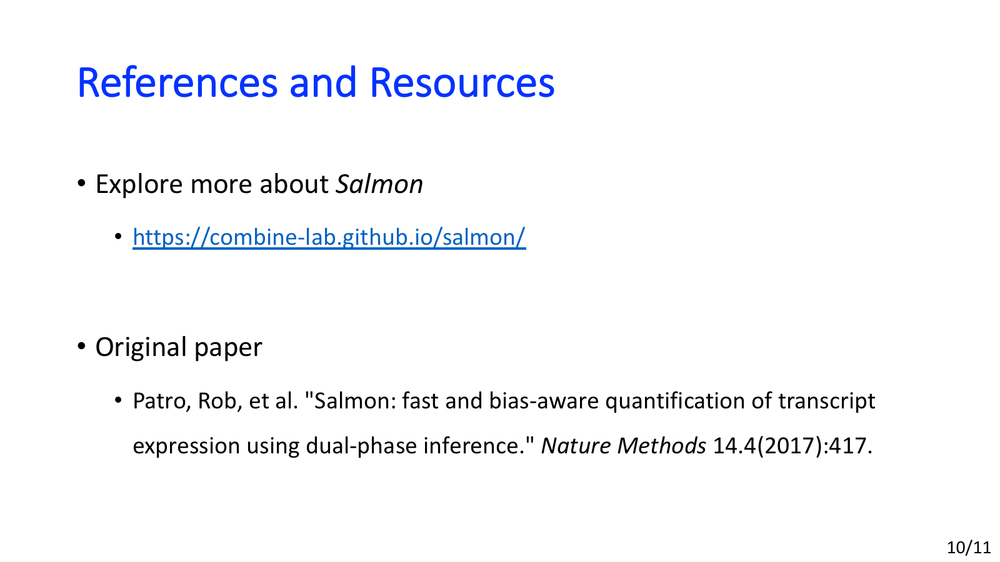{width=96%}

## Salmon tutorial
{width=81%}


## Salmon alignment
- Much quicker but will still be run on Odyssey
- First step is to create an index, then align
- For HW3, I have prepared the transcriptome file as /n/stat115/HW3_2019/transcriptome/Homo_sapiens.GRCh38.cdna.all.fa on the Odyssey

```{r, engine='bash',eval=FALSE}
#!/bin/bash
#SBATCH -N 1                   # Number of nodes
#SBATCH -n 10                  # Number of cores
#SBATCH -t 180                 # Runtime in minutes (0~10080)
#SBATCH -p general             # Partition
#SBATCH --mem=50000            # Total memory (varies across nodes)
#SBATCH -o star_%j.out         # Standard out goes to this file
#SBATCH -e star_%j.err         # Standard err goes to this file
#SBATCH --mail-type=END        # Email
#SBATCH --mail-user=YOUR_EMAIL

module load salmon

salmon index -t $TRANSCRIPTOME -i $INDEX

```

```{r, engine='bash',eval=FALSE}
sbatch createSalmonIndex.sh
```

```{r, engine='bash',eval=FALSE}
#!/bin/bash
#SBATCH -N 1                   # Number of nodes
#SBATCH -n 10                  # Number of cores
#SBATCH -t 180                 # Runtime in minutes (0~10080)
#SBATCH -p general             # Partition
#SBATCH --mem=50000            # Total memory (varies across nodes)
#SBATCH -o star_%j.out         # Standard out goes to this file
#SBATCH -e star_%j.err         # Standard err goes to this file
#SBATCH --mail-type=END        # Email
#SBATCH --mail-user=YOUR_EMAIL

module load salmon

salmon quant -i $INDEX \
             -l A \
             -1 $FASTQ/ENCFF500PDO_sub.fastq\
             -2 $FASTQ/ENCFF708KQE_sub.fastq \
             -o $OUT \
             --numBootstraps 100 \
             -p 10 \
             --gcBias

```

```{r, engine='bash',eval=FALSE}
sbatch Salmonalignment.sh
```

## Running your own alignment
- Use the commands given earlier to run your own alignment in Homework 3
- Make full use of all possible partitions on the Odyssey
- Do manage your files. Construct a file to your local folder. Batch submit your job to the cluster, outputting files to your local folder
- Upon completion, you may receive an email
- View the slurm- file and the log file (located in the output directory)
- Abundance estimates are given in the `.sf` file. Copy these to your local directory (e.g. `scp` or fileZilla) for downstream analysis (DESeq part)

## Differential expression
- Given the abundance estimates, we now wish to determine which genes/transcripts are differentially expressed between condition.
- Just like in microarrays, we need to create a design matrix specifying what we wish to estimate
- We will be making use of the `DESeq2` packages. Install this via bioconductor.
```{r, eval=FALSE}
# Install required packages
source("https://bioconductor.org/biocLite.R")
biocLite("BiocUpgrade")
biocLite("DESeq2")
biocLite("tximport")
biocLite("EnsDb.Hsapiens.v86")
biocLite("EnsDb.Mmusculus.v79")
install.packages("rjson")
```

## Differential expression
- Load the package.
- Create a data frame with columns as specified below containing the necessary information for the design matrix (sampleName, fileName, condition).
```{r,message=FALSE,warning=FALSE}
library(DESeq2)
files <- grep("sf",list.files("Data"),value=TRUE)
condition <- c("4oh", "4oh", "4oh", "ctrl", "ctrl", "ctrl")
names <- c("4oh1", "4oh2", "4oh3", "ctrl1", "ctrl2", "ctrl3")
sampleTable <- data.frame(sampleName = files, fileName = files, condition = condition)
```

## Differential expression
- Utilizing the mouse transcriptome as below, extract the transcript id columns and the gene id columns.
- Might need to change the Ensembl based annotation package for mouse into the package for human, say change EnsDb.Mmusculus.v79 to EnsDb.Hsapiens.v86.

```{r,message=FALSE,warning=FALSE}
library(EnsDb.Mmusculus.v79)
txdf <- transcripts(EnsDb.Mmusculus.v79, return.type="DataFrame")
tx2gene <- as.data.frame(txdf[,c("tx_id", "gene_id")])
```

## Differential expression
- Now we're going to import the data and format the data for analysis.
- Remove rows with a total row count less than or equal to 1.
- This step might take a few minutes.
- Run the analysis!
```{r,message=FALSE,warning=FALSE}
library(tximport)
txi <- tximport(file.path("Data",files), type="salmon", ignoreTxVersion = TRUE, tx2gene = tx2gene)
dds <- DESeqDataSetFromTximport(txi,colData=sampleTable,design=~condition)
dds <- dds[rowSums(counts(dds)) > 1, ]
dds <- DESeq(dds)
```

## Differential expression
- Extract the significantly DE genes at the .05 significance level.
- Remove incomplete observations (those with missing column data).
- Find those DE genes significantly up/down regulated with an adjusted p-value below .05. How many are there?
```{r,message=FALSE,warning=FALSE}
res <- results(dds, alpha = 0.05)
res <- res[complete.cases(res),]
res <- res[order(res$padj),]
upR <- res[(res$padj < 0.05) & (res$log2FoldChange > 0),]
downR <- res[(res$padj < 0.05) & (res$log2FoldChange < 0),]
nrow(upR)
nrow(downR) 
```

## Visualizing results
- Which plot should we use to visualize the differential expression? Use it to visualize the results.
- Any other thoughts on how to further visualize the results?
```{r,message=FALSE,warning=FALSE}
plotMA(res)
```

```{r,message=FALSE,warning=FALSE}
absOrdered <- rbind(upR,downR)
absOrdered <- absOrdered[order(abs(absOrdered$log2FoldChange),decreasing = TRUE),]
mostvariable <- log2(txi$abundance[row.names(absOrdered),]+.0001)

library(gplots)
heatmap.2(mostvariable[1:100,],trace="none",col=greenred(10))
```

## Odyssey Fest
- A summary for our experiences
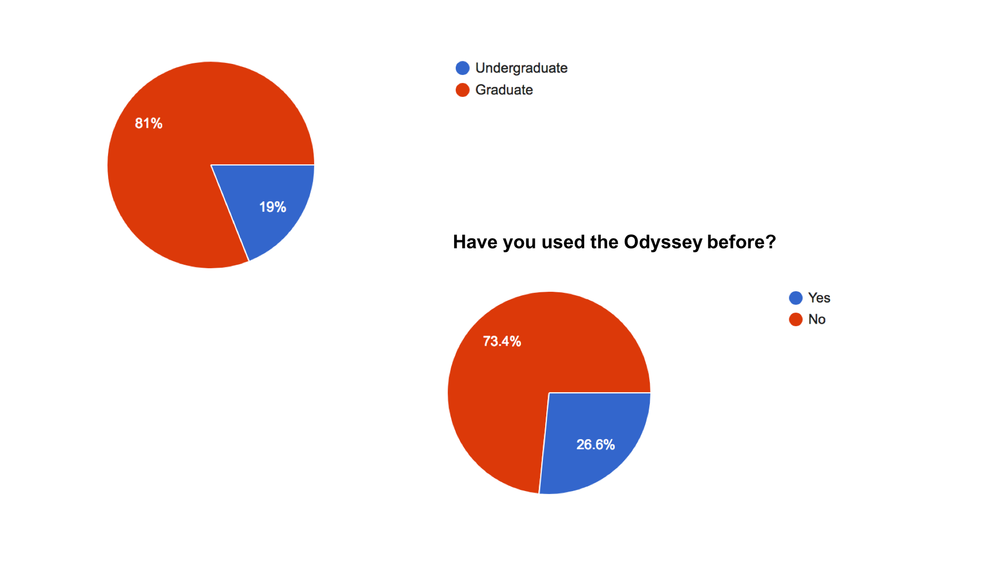{width=96%}

## Odyssey Fest
- How to make full use of all partitions

```{r, engine='bash',eval=FALSE}
#!/bin/bash
#SBATCH -N 1                   # Number of nodes
#SBATCH -n 10                  # Number of cores
#SBATCH -t 240                 # Runtime in minutes (0~10080)
#SBATCH -p general,serial_requeue,shared  # Partition
#SBATCH --mem=50000            # Total memory (varies across nodes)
#SBATCH -o salmon_%j.out         # Standard out goes to this file
#SBATCH -e salmon_%j.err         # Standard err goes to this file
#SBATCH --mail-type=END        # Email
#SBATCH --mail-user=ytang@hsph.harvard.edu

module load salmon

salmon index -t $TRANSCRIPTOME -i $INDEX
```

## Basic Operations Reminder (A Small Cheat Sheet)
- Log in the cluster: ssh command

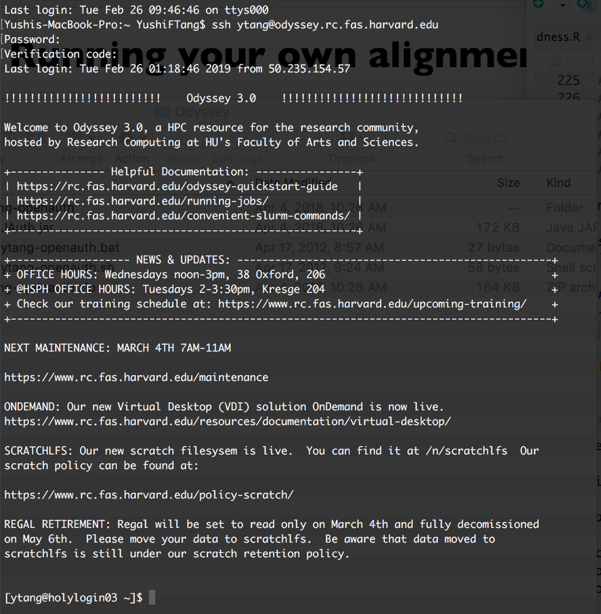{width=96%}

- Running jobs interactively: srun command
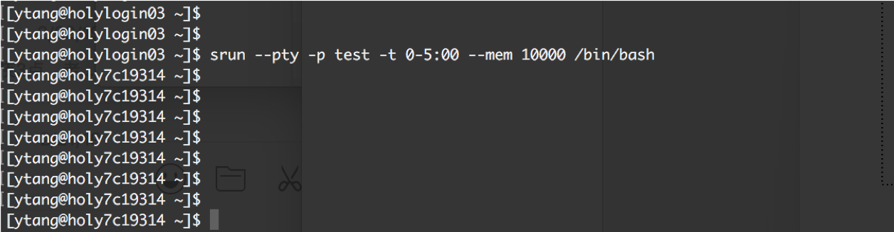{width=96%}

- View files under current location: ls command
- Change path: cd command
- Create path: mkdir command
- Rename path: mv command

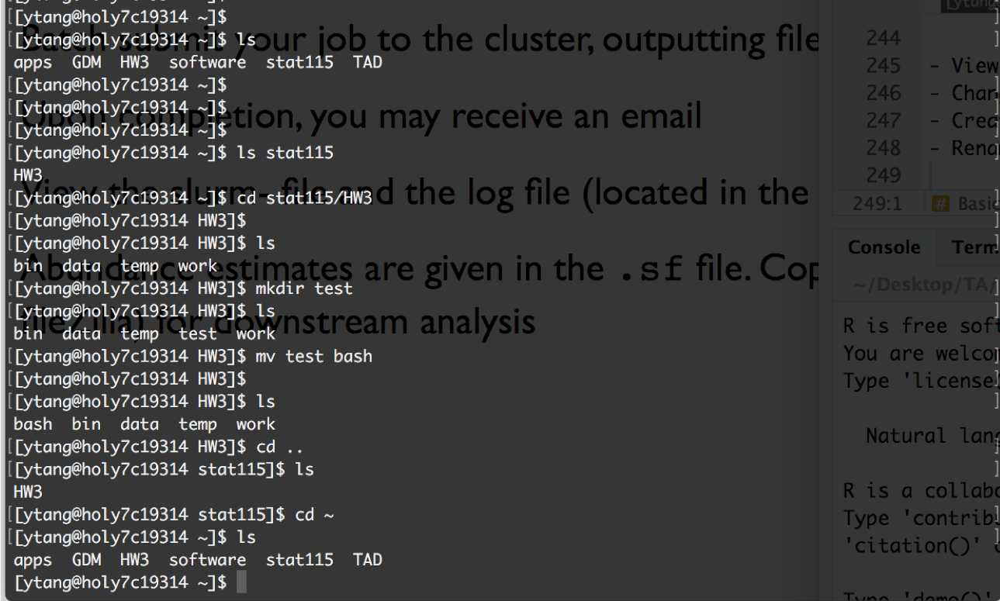{width=96%}

## Cluster Computing Reminder (A Small Cheat Sheet)
- Upload scripts to the Odyssey
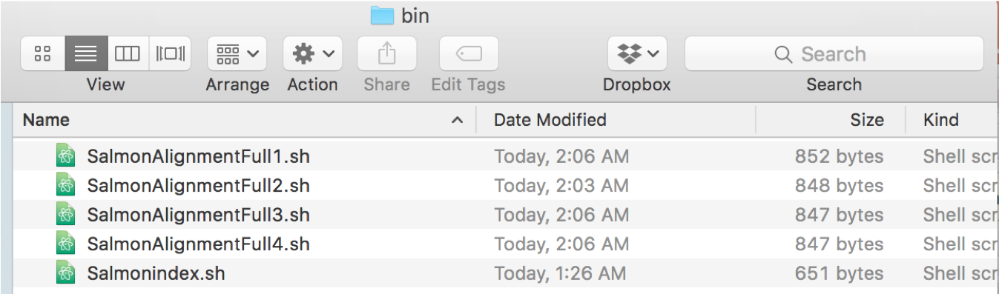{width=96%}

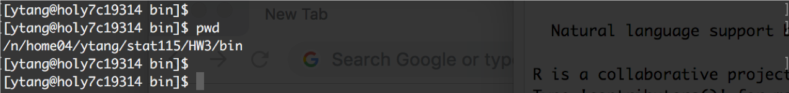{width=96%}

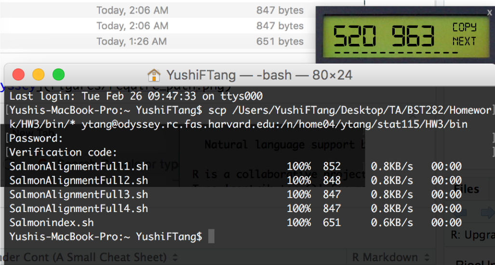{width=96%}


- View scripts on the Odyssey

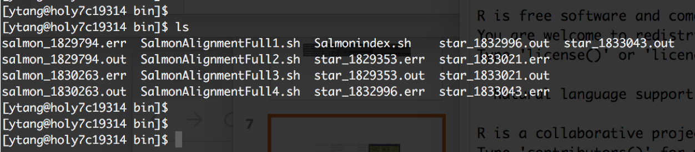{width=96%}

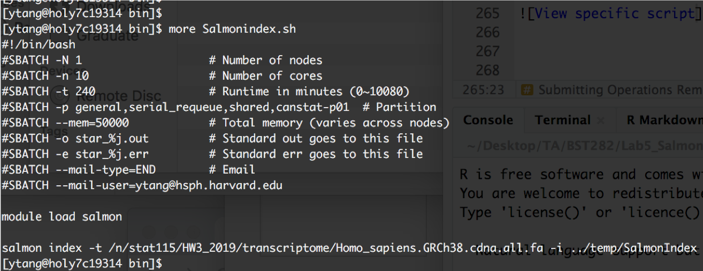{width=96%}

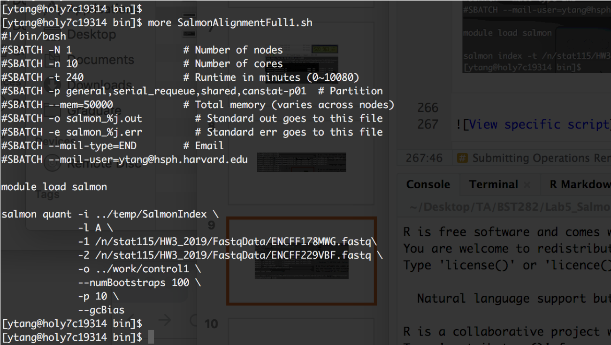{width=96%}


- Submit jobs to the cluster: sbatch command
- Manage jobs on the cluster: sbatch command
- Kill jobs on the cluster: scancel command

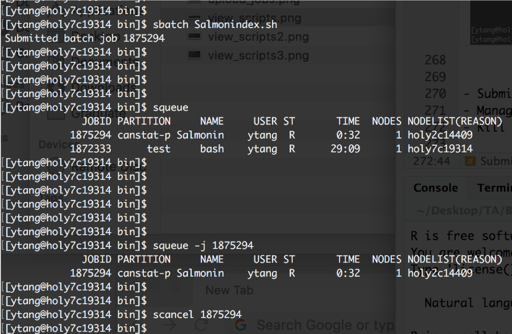{width=96%}

- Locate the output and download: scp command
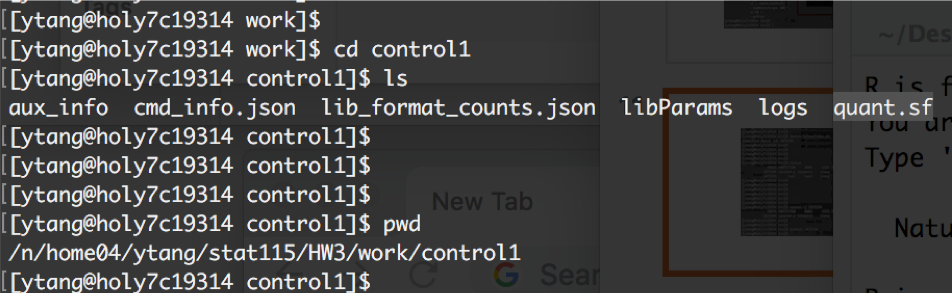{width=96%}

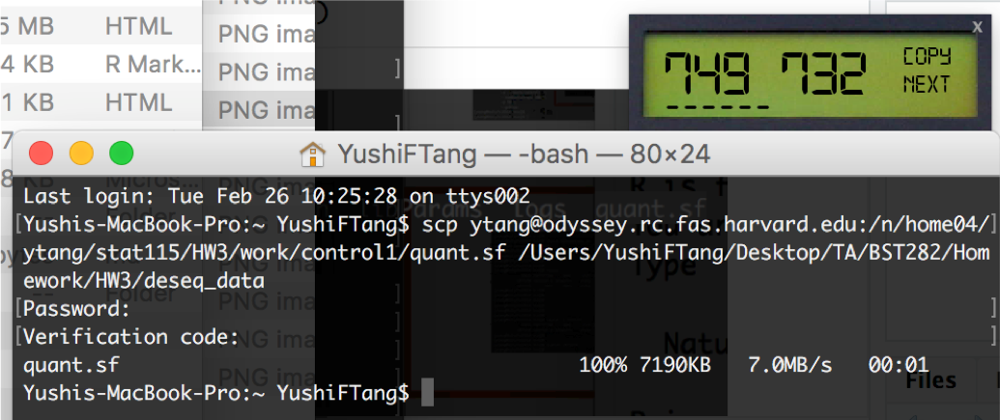{width=96%}


## Cheer for Experiences

Part I. RNA-seq analyses

```{r libraries, message = FALSE,eval = FALSE}
library(DESeq2)
library(EnsDb.Hsapiens.v86)
library(tximport)
library(rjson)
library(Seurat)
library(dplyr)
```

For this HW, we will use the RNA-seq data of HepG2 with U2AF1 knock down and control, each with 2 replicates. 
https://www.ncbi.nlm.nih.gov/geo/query/acc.cgi?acc=GSE88002
https://www.ncbi.nlm.nih.gov/geo/query/acc.cgi?acc=GSE88226 

The raw FASTQ files are available on Odyssey at: /n/stat115/HW3_2019/FastqData/

## Question 1:
1. In HW2, we explored RNA-seq read alignment to the reference genome using STAR (there are also algorithms such as TopHat and HiSAT, etc). They are relatively slow compared to the newer pseudo-mapping techniques such as Kalisto and Salmon which only align reads to the RefSeq transcriptome. These pseudo-aligners greatly simplify the process of going from FASTQ to read counts on genes and are much faster. Run Salmon (Patro et al, Nat Methods 2017) on this data to generate the quant.sf file. How does Salmon on a full RNA-seq data compare in runtime to STAR on 3M fragments in HW2? What is the gene with the highest TMP in the sample? 
Hint: Check out the original experiment design to match the fastq files correctly.
https://www.encodeproject.org/experiments/ENCSR067GHD/
https://www.encodeproject.org/experiments/ENCSR372UWV/

Solution:

1). Run Salmon on the full data seperately for four pair-wise samples.

Preparing work: Build Salmon Index

This part takes around 2 min 59 seconds for Odyssey to run.

```{r, engine='bash', eval=FALSE}
#!/bin/bash
#SBATCH -N 1                   # Number of nodes
#SBATCH -n 10                  # Number of cores
#SBATCH -t 240                 # Runtime in minutes (0~10080)
#SBATCH -p general,serial_requeue,shared  # Partition
#SBATCH --mem=50000            # Total memory (varies across nodes)
#SBATCH -o salmon_%j.out         # Standard out goes to this file
#SBATCH -e salmon_%j.err         # Standard err goes to this file
#SBATCH --mail-type=END        # Email
#SBATCH --mail-user=ytang@hsph.harvard.edu

module load salmon

salmon index -t /n/stat115/HW3_2019/transcriptome/Homo_sapiens.GRCh38.cdna.all.fa -i ../temp/SalmonIndex
```

```{r, engine='bash', eval=FALSE}
sbatch Salmonindex.sh
```

a). For Control group replicate 1: ENCFF178MWG and ENCFF229VBF

This part takes around 15 min 16 seconds for Odyssey to run.

```{r, engine='bash',eval=FALSE}
#!/bin/bash
#SBATCH -N 1                   # Number of nodes
#SBATCH -n 10                  # Number of cores
#SBATCH -t 240                 # Runtime in minutes (0~10080)
#SBATCH -p general,serial_requeue,shared  # Partition
#SBATCH --mem=50000            # Total memory (varies across nodes)
#SBATCH -o star_%j.out         # Standard out goes to this file
#SBATCH -e star_%j.err         # Standard err goes to this file
#SBATCH --mail-type=END        # Email
#SBATCH --mail-user=ytang@hsph.harvard.edu

module load salmon

salmon quant -i ../temp/SalmonIndex \
             -l A \
             -1 /n/stat115/HW3_2019/FastqData/ENCFF178MWG.fastq\
             -2 /n/stat115/HW3/FastqData/ENCFF229VBF.fastq \
             -o ../work/control1 \
             --numBootstraps 100 \
             -p 10 \
             --gcBias

```

```{r, engine='bash',eval=FALSE}
sbatch SalmonAlignmentFull1.sh
```

b). For Control group replicate 2: FASTQ1 and FASTQ2

```{r, engine='bash',eval=FALSE}
sbatch SalmonAlignmentFull2.sh
```

c). For Mutant group replicate 1: FASTQ1 and FASTQ2

```{r, engine='bash',eval=FALSE}
sbatch SalmonAlignmentFull3.sh
```

d). For Mutant group replicate 2: FASTQ1 and FASTQ2

```{r, engine='bash',eval=FALSE}
sbatch SalmonAlignmentFull4.sh
```


## Question 2:

2. Run DESeq2 (Love et al, Genome Biol 2014) to find the differentially expressed transcripts between U2AF1 knock down and control. How many RefSeq transcripts are up vs down-regulated by U2AF1 knock down? Provide an MA plot displaying the differential expression.  Hint: https://www.bioconductor.org/help/workflows/rnaseqGene/ 

```{r eval = FALSE}
# Build index for control and mutant groups
files <- grep("sf",list.files("deseq_data"),value=TRUE)
condition <- c("control","control","mutant","mutant")
names <- c("control1", "control2", "mutant1", "mutant2")
sampleTable <- data.frame(sampleName = files, fileName = files, condition = condition)

# Add gene references according to EnsDb.Hsapiens.v86
txdf <- transcripts(EnsDb.Hsapiens.v86, return.type="DataFrame")
tx2gene <- as.data.frame(txdf[,c("tx_id", "gene_id")])

# Perform DESeq analysis
txi <- tximport(file.path("deseq_data",files), type="salmon", ignoreTxVersion = TRUE, tx2gene = tx2gene)
dds <- DESeqDataSetFromTximport(txi,colData=sampleTable,design=~condition)
dds <- dds[rowSums(counts(dds)) > 1, ]
dds <- DESeq(dds)
res <- results(dds, alpha = 0.01)
res <- res[complete.cases(res),]
res <- res[order(res$padj),]
upR <- res[(res$padj < 0.01) & (res$log2FoldChange > 0),]
downR <- res[(res$padj < 0.01) & (res$log2FoldChange < 0),]
nrow(upR)
nrow(downR) 

plotMA(res)
```


## Question 3:

3. Use some GO analysis tool to examine whether U2AF1 regulates some specific functions / processes / pathways. 

```{r eval = FALSE}
# Now we write out the up-regulated and down-regulated gene symbles
# Then we performed GO analysis on DAVID with both of them
write.csv(upR@rownames, file = "Up.csv")
write.csv(downR@rownames, file = "Down.csv")
```

Some useful gene and GO analysis tools:

1. HGNC: https://www.genenames.org/

2. RefSeq: https://www.ncbi.nlm.nih.gov/refseq/

3. UniProt: http://www.uniprot.org/uniprot/

4. GOA (Gene Ontology Annotation): https://www.ebi.ac.uk/GOA

5. AmiGO!: http://amigo1.geneontology.org/

6. DAVID: https://david.ncifcrf.gov/summary.jsp


## Question 4

4. For GRADUATE students: DESeq2 can optionally aggregate the differential expression at either transcript (no aggregate) or gene level (aggregate). How do the DE results compare between with and without aggregation to gene level, in terms of the genes / transcripts called and the GO categories? 

```{r eval = FALSE}
# For transcript (no aggregate) level
library(tximport)
txi_transcript <- tximport(file.path("deseq_data",files), type="salmon", 
                           txOut = TRUE, ignoreTxVersion = TRUE, tx2gene = tx2gene)
dds_transcript <- DESeqDataSetFromTximport(txi_transcript,colData=sampleTable,design=~condition)
dds_transcript <- dds_transcript[rowSums(counts(dds_transcript)) > 1, ]
dds_transcript <- DESeq(dds_transcript)
res_transcript <- results(dds_transcript, alpha = 0.01)
res_transcript <- res_transcript[complete.cases(res_transcript),]
res_transcript <- res_transcript[order(res_transcript$padj),]
upR_transcript <- res_transcript[(res_transcript$padj < 0.01) & (res_transcript$log2FoldChange > 0),]
downR_transcript <- res_transcript[(res_transcript$padj < 0.01) & (res_transcript$log2FoldChange < 0),]
nrow(upR_transcript)
nrow(downR_transcript)
```

```{r eval = FALSE}
# Write out the files for DAVID analysis
write.csv(upR_transcript@rownames, file = "UpTranscript.csv")
write.csv(downR_transcript@rownames, file = "DownTranscript.csv")
# Perform GO analysis with DAVID
```

```{r eval = FALSE}
# For gene level (aggregate)
library(tximport)
txi_gene <- tximport(file.path("deseq_data",files), type="salmon", 
                     txOut = FALSE, ignoreTxVersion = TRUE, tx2gene = tx2gene)
dds_gene <- DESeqDataSetFromTximport(txi_gene,colData=sampleTable,design=~condition)
## Similar analysis as previous part
```

```{r eval = FALSE}
# Write out the files for DAVID analysis
write.csv(upR_gene@rownames, file = "UpGene.csv")
write.csv(downR_gene@rownames, file = "DownGene.csv")
# Perform GO analysis with DAVID
```

## Question 5:

5. For GRADUATE students: Are the same genes or transcripts called as differentially expressed if you use TPMs (i.e. abundances) instead of counts? Explain the difference between TPMs and counts.
```{r eval = FALSE}
txi_gene_tpm <- txi_gene
txi_gene_tpm$counts = txi_gene_tpm$abundance
dds_gene_tpm <- DESeqDataSetFromTximport(txi_gene_tpm,colData=sampleTable,design=~condition)
dds_gene_tpm <- dds_gene_tpm[rowSums(counts(dds_gene_tpm)) > 1, ]
dds_gene_tpm <- DESeq(dds_gene_tpm)
# The following analysis are similar as the previous part
```


## Rules for submitting the homework:

Please submit your solution directly on the canvas website. Please
provide both your code in this Rmd document and an html file for your
final write-up. Please pay attention to the clarity and cleanness of
your homework.

The teaching fellows will grade your homework and give the grades with
feedback through canvas within one week after the due date. Some of the
questions might not have a unique or optimal solution. TFs will grade
those according to your creativity and effort on exploration, especially
in the graduate-level questions.

## Good Luck!
- Office hour until 7:00 pm for Tuesday
- Office hour until 8:00 pm for Thursday
- Potential additional office hour on each Friday 11:30 am - 12:30 pm @ HSPH since next week


