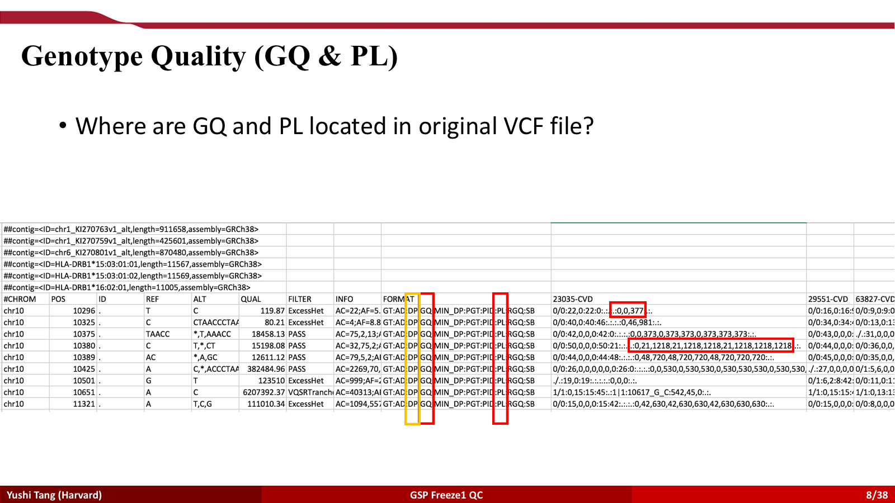
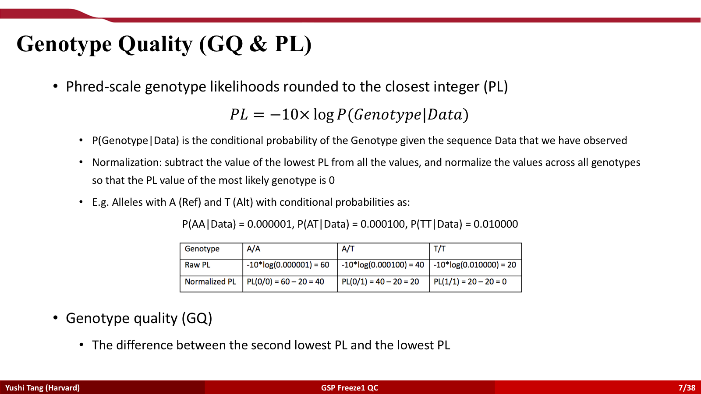
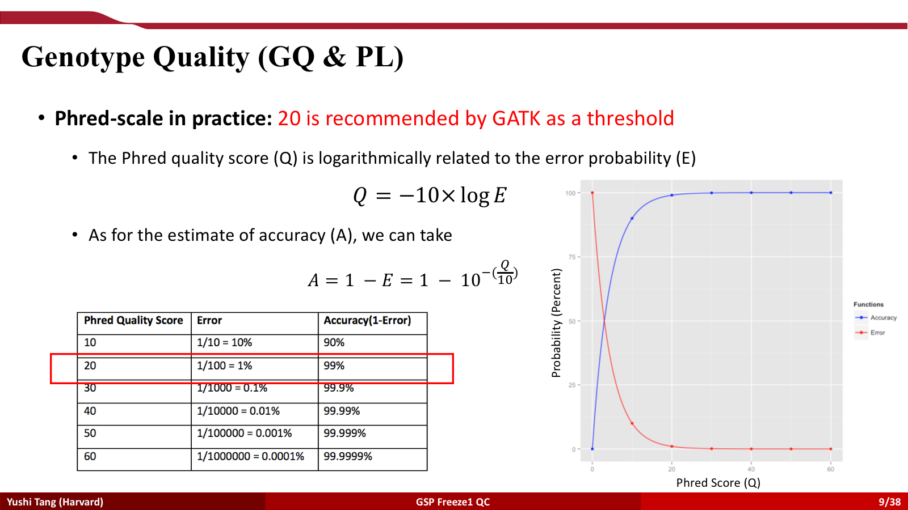
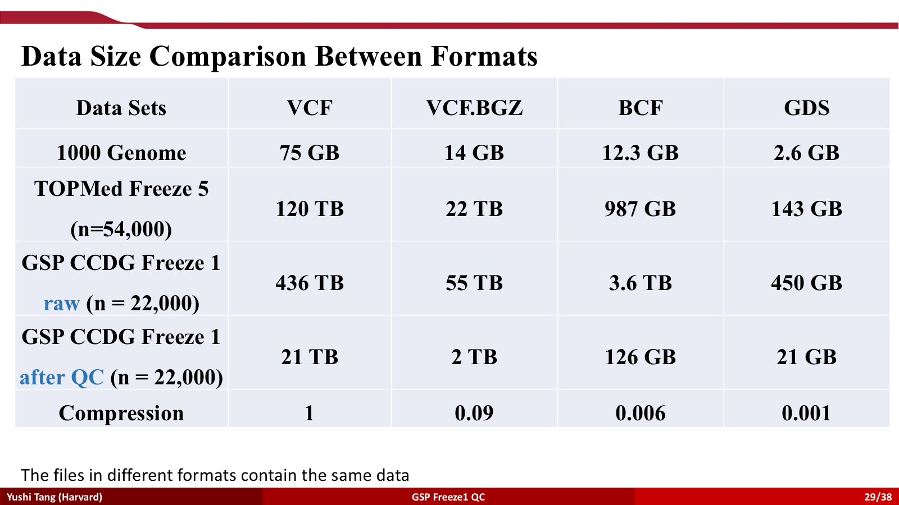
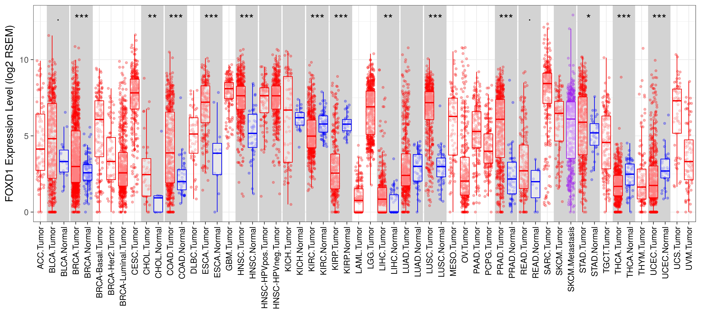
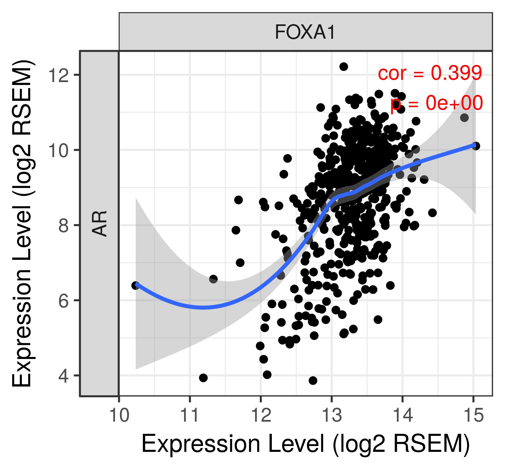
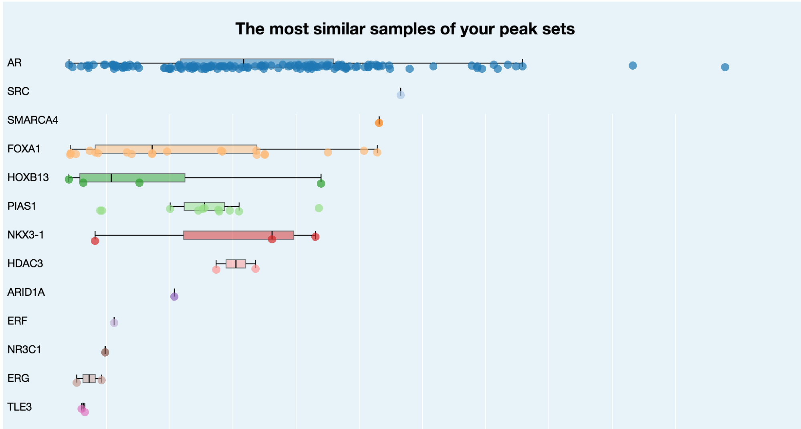

```{r setup, include=FALSE}
knitr::opts_chunk$set(echo = TRUE, fig.align = "center")
```

## Anouncements

- No additional office hour for this Friday due to the open house event
- HW4 is due on March 31, 2019 @ 11:59 pm


## Outline

- BETA
    - Overview
    - Workflow
    - Interpretation
    - Post-BETA analysis
- VCF and Statistical Genomics
- Cheer for Experiences
    - More about ChIP-seq motifs
    
## Motivation

- Given peaks called from ChIP-seq, we are interested in assessing which genes are regulated by the given factor (TFs or chromatin regulators)
    - I.e. *Target genes*

- A simple method would be to assign the nearest gene or the gene containing peaks in its promoter region

- But ChIP-seq experiments are often examined in the context of gene expression, and thus expression profiles are available for both the factor-bound and factor-unbound conditions

- So how can this information be incorporated with the peaks to improve inference about target genes?

## Binding and expression target analysis (BETA)

- Software package to analyze factor binding and differential expression in mammalian genomes
    - Paper: https://www.nature.com/articles/nprot.2013.150
    - Source code: http://cistrome.org/BETA 
    - Web tool: http://cistrome.org/ap/
    _ Note we will be using the web tool for the homework, no need to download the source code!

{width=96%}

## BETA overview

- Incorporates differential expression and ChIP-seq peaks

1. Call genes up-/down-regulated (LIMMA)
    - Also save a list of non-DE genes
2. Call peaks (MACS)
3. Combine to infer (BETA):
    - Whether factor has activating/repressive function
    - Identify direct target genes
    - Identify binding motif and collaborators (Beta-plus)

## BETA overview


## BETA workflow

1. Use LIMMA to detect up-/down-DE genes (CSV file)

2. Output genes in three categories (up-regulated,down-regulated,unchanged)
    - May need to use a more stringent cutoff if too many genes
    
3. Binding events/peaks called from MACS (BED file)

## Activating/repressive function prediction

4. For each gene in the CSV files, estimate its regulatory potential
    - *The likelihood the gene is regulated by the TF*
    - Scored *per gene* as the sum of the *contribution of individual binding sites* within a user-defined distance
    - The contribution of each site is modelled by a monotonically decreasing function based on the distance between the binding site and transcription start site
    - $S_g = \sum_{i=1}^k e^{-(.5 + 4 \delta_i)}$ where $\delta_i$ is the distance from above divided by 100KB
    
5. By category (up,down,unchanged), rank the genes by decreasing score

6. Calculate cumulative distribution function of the gene groups

7. Use a one-tailed Kolmogorov-Smirnov test to determine whether the groups differ significantly from the unchanged group

## Activating/repressive function prediction
#### How to interpret this picture?
#### AR is an upregulator/activator


## Practice: Tet1 in mouse ES cells
#### The Tet1 is a repressor. Pay attention to the biological explaination. 


## Practice: ESR1 in MCF-7 cells
####  This is both an activator and a repressor. 


## Direct target prediction

8. Sort and assign ranks to peaks based on regulatory potential

9. Sort and assign ranks to genes based on differential expression

10. Compute rank product (interpreted as a p-value).

11. Results are output as a table. Threshold based on score/p-value for confident target genes

## Binding motif analysis

- BETA conducts motif analysis on sites proximal to the targets to identify factor-binding motifs

- Compares the number of motifs near the ChIP-seq binding summits with that in flanking regions to detect motifs with marked summit enrichment

- Results summarized in a web page


## Binding motif analysis


## Binding motif analysis


## Post-BETA analysis

- Gene ontology of gene list (DAVID, separate by up-/down-regulated)

- Motif analysis

- Co-factor analysis (Intersect the BETA list with the original DE list)

## BETA software summary

- BETA-basic, BETA-plus and BETA-minus

- BETA-basic can be used to predict whether a factor has activating or repressive function and detect direct target genes

- BETA-plus can be used to predict whether a factor has activating or repressive function, whether it can detect direct target genes and whether it can analyze sequence motifs in target regions

- BETA-minus is used when only binding data are available to predict target genes based on distance

- Both binding and differential expression data are required for BETA-basic and BETA-plus

## VCF: Overview
- VCF is a text file format
- Contains meta-information line with each line containing information about a position in the genome
- Overview of the data sturcture

## VCF: Format Details
- Genotype information across all samples at a specific position

{width=96%}


## VCF: Format Details
- Genotype information across all samples at a specific position
- Individual genotype information for each sample at each position
{width=96%}

{width=96%}

{width=96%}


## VCF: Computing problems
-  Multiple allele per row. Extremely hard to conduct basic statistical genetics analysis
-  Hard to incoporate other epigenetic features
-  Space consuming
{width=96%}

## Cheer for Experiences

The main topic for this experience is ChIP-seq, motif finding, and expression integration. Androgen receptor (AR) is a transcription factor frequently over-activated in prostate cancer. To study AR regulation in prostate cancer, scientists conducted AR ChIP-seq in prostate tumors and normal prostate tissues. Since the difference between individual patients could be quite big, this study actually included many more tumor and normal samples. However, for the purpose of this HW, we will only use the ChIP-seq data from 1 prostate tumor samples (tumor) and 1 normal prostate tissues (normal).  

Hint:
1). All data needed for this HW are stored at /n/stat115/HW4_2019 on the Odyssey.
2). It would be helpful to read the MACS README and Nature Protocol paper:

https://pypi.python.org/pypi/MACS2/2.0.10.09132012

http://liulab.dfci.harvard.edu/publications/NatProtoc12_1728.pdf 


## Part I. Call AR ChIP-seq peaks

## Question 1: 

Usually we use BWA to map the reads to the genome for ChIP-seq experiment. We will give you one example ChIP-seq single-end sequenced .fastq file with only 1M reads. Run BWA on this file to Hg38 of the human genome assembly. Report the commands, logs files, and a snapshot / screenshot of the output to demonstrate your alignment procedure. What proportion of the reads are successfully mapped (to find at least one location) and what proportions are uniquely mapped (to find a single location) in the human genome in this test sample? We will save you some time and directly give you the BWA mapped BAM files for the sample.

Hint: 
1). Target sample fastq file is stored as /n/stat115/HW4_2019/tumor_1M.fastq on the Odyssey
2). The index file is stored as /n/stat115/HW2_2019/bwa_hg38_index/hg38.fasta on the Odyssey

```{r, engine='bash', eval=FALSE}
# your shebang

module load bwa/0.7.15-fasrc02

bwa mem /path/to/index/fasta /path/to/input/data > /path/to/output/file/your_output_name.sam

```

```{r, engine='bash', eval=FALSE}
# samtools might be useful to acquire the summary statistics
# of course you have to load the samtools module first
$ samtools flagstat bwa.sam
$ samtools view -bq 1 bwa.sam > unique.bam
$ samtools flagstat unique.bam
```


## Question 2:

In ChIP-Seq experiments, when sequencing library preparation involves a PCR amplification step, it is common to observe multiple reads where identical nucleotide sequences are disproportionally represented in the final results. This is especially a problem in tissue ChIP-seq experiments (as compared to cell lines) when input cell numbers are low. Removing these duplicated reads can improve the peak calling accuracy. Thus, it may be necessary to perform a duplicate read removal step, which flags identical reads and subsequently removes them from the dataset. Run this on your test sample (1M reads) (macs2 filterdup). What % of reads are redundant? When doing peak calling, MACS filters duplicated reads by default. 

Hint:
The test samples are stored as /n/stat115/HW4_2019/tumor.bam and /n/stat115/HW4_2019/normal.bam on the Odyssey.


```{r, engine='bash', eval=FALSE}
# your shebang

module load 

macs2 filterdup -i /path/to/input/bam/file -g hs --keep-dup 1 -o ./path/to/output/bed/file/your_output_name.bed
```

## Question 3:

For many ChIP-seq experiments, usually chromatin input without enriching for the factor of interest is often generated as control. However, in this experiment, we only have ChIP and no control samples. Without control, MACS2 will use the signals around the peaks to infer the chromatin background and estimate the ChIP enrichment over background. What is the estimated fragment size in each? Use MACS2 to call peaks from tumor1 and normal1 separately. How many peaks do you get from each condition with FDR < 0.05 and fold change > 5? 

Call peak for normal sample

```{r, engine='bash', eval=FALSE}
# your shebang

module load centos6/0.0.1-fasrc01
module load macs2/2.1.2_dev-fasrc01

macs2 callpeak -t /path/to/your/input/sample/bed/file.bed -f AUTO -g 2.7e9 -q 0.05 -m 6 50 --outdir path/to/save/your/output/ -n prefix_of_your_output
```

```{r, engine='bash', eval=FALSE}
-t/--treatment filename
-c/--control
-n/--output name
-f/--format of tag files
--outdir/--the folder where all the output files saved into
-n/--name of the output as NAME_peaks.bed
-g/--gsize The default hs -- 2.7e9 is recommended as_for UCSC human hg18 assembly
-q/--qvalue (minimum FDR) cutoff to call significant regions. Default is 0.05.
```

Repeat this for the tumor sample


## Question 4:

Now we want to see whether AR has differential binding sites between prostate tumors and normal prostates. MACS2 does have a function to call differential peaks between conditions, but requires both conditions to have input control. Since we don’t have input controls for these AR ChIP-seq, we will just run the AR tumor ChIP-seq over the AR normal ChIP-seq (pretend the latter to be input control) to find differential peaks. How many peaks do you get with FDR < 0.01 and fold change > 6?

```{r, engine='bash', eval=FALSE}
# your shebang

module load centos6/0.0.1-fasrc01
module load macs2/2.1.2_dev-fasrc01

macs2 callpeak -t path/to/your/treat.bed -c path/to/your/control.bed -f AUTO -g 2.7e9 -q 0.01 --fe-cutoff 6 --outdir path/to/your/output/folder/ -n prefix_of_your_output

```


## Part II. Evaluate AR ChIP-seq data quality 

## Question 5:

Cistrome Data Browser (http://cistrome.org/db/) has collected and pre-processed most of the published ChIP-seq data in the public. Play with Cistrome DB. Biological sources indicate whether the ChIP-seq is generated from a cell line (e.g. VCaP, LNCaP, PC3, C4-2) or a tissue (Prostate). Are there over 10 AR ChIP-seq data available in human prostate tissues? 


## Question 6:

Doing transcription factor ChIP-seq in tissues could be a tricky experiment, so sometimes even published studies have very bad data. Look at a few AR ChIP-seq samples in the prostate tissue on Cistrome and inspect their QC reports. Can you comment on what QC measures tell you whether a ChIP-seq is of good or bad quality. Include a screen shot of a good AR ChIP-seq vs a bad AR ChIP-seq. 

## Question 7:

Antibody is one important factor influencing the quality of a ChIP-seq experiment. Click on the GEO (GSM) ID of some good quality vs bad quality ChIP-seq data, and see where they got their AR antibodies. If you plan to do an AR ChIP-seq experiment, which company and catalog # would you use to order the AR antibody? 

# Part III Find AR ChIP-seq motifs

## Question 8:

We want to see in prostate tumors, which other transcription factors (TF) might be collaborating with AR. Try any of the following motif finding tools to find TF motifs enriched in the differential AR peaks you identified above. Did you find the known AR motif, and motifs of other factors that might interact with AR in prostate cancer in gene regulation? Describe the tool you used, what you did, and what you found. Note that finding the correct AR motif is usually an important criterion for AR ChIP-seq QC.

Cistrome: http://cistrome.org/ap/root (Register a free account).

Weeder: http://159.149.160.88/pscan_chip_dev/

HOMER: http://homer.ucsd.edu/homer/motif/ 

MEME: http://meme-suite.org/tools/meme-chip 


## Question 9: 

Look at the AR binding distribution in Cistrome DB from a few good AR ChIP-seq data in prostate. Does AR bind mostly in the gene promoters, exons, introns, or intergenic regions? Also, look at the QC motifs to see what motifs are enriched in the ChIP-seq peaks. Do you see similar motifs here as those you found in your motif analyses? 

# Part IV. Identify AR-interacting transcription factors

## 10. For both:

Sometimes members of the same transcription factor family (e.g. STAT1, 2, 3, 4, 5, 6) have similar binding motifs, similar binding sites (when they are expressed, although they might be expressed in very different tissues), and related functions. Therefore, to confirm that we have found the correct TFs interacting with AR in prostate tumors, in addition to looking for motifs enriched in the AR ChIP-seq, we also want to see whether the TFs are highly expressed in prostate tumor. For this, we will use TIMER (https://cistrome.shinyapps.io/timer/). First, try the “Diff Exp” tab. Check the top motifs you found before, and see which member of the TF family that recognizes the motif is highly expressed in prostate tissues or tumors. Another way is to see whether the TF family member and AR have correlated expression pattern in prostate tumors. Go to the “Correlation” tab, select prostate cancer (PRAD), enter AR and the gene you are interested in, correct the correlation by tumor purity, and see whether the candidate TF is correlated with AR in prostate tumors. Based on the motif and expression evidences, which factors are the most likely collaborator of AR in prostate cancer?

Note: When we conduct RNA-seq on prostate tumors, each tumor might contain cancer cells, normal prostate epithelia cells, stromal fibroblasts, and other immune cells. Therefore, genes that are highly expressed in cancer cells (including AR) could be correlated in different tumors simply due to the tumor purity bias. Therefore, when looking for genes correlated with AR just in the prostate cancer cells, we should correct this tumor purity bias. 

Solution:

{width=96%}


{width=96%}

## 11. For both:

Besides looking for motif enrichment, another way to find TFs that might interact with AR is to see whether there are other TF ChIP-seq data which have significant overlap with AR ChIP-seq. Take the differential AR ChIP-seq peaks (in .bed format) that are significantly higher in tumor than normal, and run this on the Cistrome Toolkit (http://dbtoolkit.cistrome.org/). The third function in Cistrome Toolkit looks through tens of thousands of published ChIP-seq data to see whether any have significant overlap with your peak list. You should see AR enriched in the results (since your input is a list of AR ChIP-seq peaks after all). What other factors did you see enriched? Do they agree with your motif analyses before? 

Solution:

{width=96%}


# PART V. Find AR direct target genes and pathways

## 12. For GRADUATE students:

Now we try to see what target genes these AR binding sites regulate. Among the differentially expressed genes in prostate cancer, only a subset might be directly regulated by AR binding. One simple way of getting the AR target genes is to look at which genes have AR binding in its promoters. Write a python program that takes two input files: 1) the AR differential ChIP-seq peaks in tumor over normal; 2) refGene annotation. The program outputs to a file containing genes that have AR ChIP-seq peak (in this case, stronger peak in tumor) within 3KB + / - from the transcription start site (TSS) of the gene. How many putative AR target genes in prostate cancer do you get using this approach? 

Note: From UCSC (http://hgdownload.soe.ucsc.edu/goldenPath/hg38/database/), download the human RefSeq annotation table (find the file refGene.txt.gz for Hg38). To understand the columns in this file, check the query annotation at http://hgdownload.soe.ucsc.edu/goldenPath/hg38/database/refGene.sql. 

Hint: TSS is different for genes on positive or negative strand, i.e. TSS is “txStart” for genes on the positive strand, “txEnd” for genes in negative strand. When testing your python code, try smaller number of gene annotations or smaller number of peaks to check your results before moving forward. 

```{r, eval = FALSE}
# Prepare the reference .bed file
TSS <- read.table('./data/refGene.txt')
head(TSS)
TSS <- TSS[,c(3,5,6,4,2)]
colnames(TSS) <- c('chr','start','end','strand','id')
TSS_positive_strand <- subset(TSS,TSS$strand=='+')
TSS_negative_strand <- subset(TSS,TSS$strand=='-')

head(TSS_positive_strand)
TSS_positive_strand$end <- TSS_positive_strand$start
head(TSS_positive_strand)

head(TSS_negative_strand)
TSS_negative_strand$start <- TSS_negative_strand$end
head(TSS_negative_strand)

TSS_new <- rbind(TSS_positive_strand,TSS_negative_strand)
TSS_new$end <- TSS_new$start+1
write.table(TSS_new,"./data/TSS_HG38.bed", sep = '\t',
            quote=FALSE,row.names=FALSE, col.names=FALSE)
```


```{r, engine='bash', eval=FALSE}
# Please remember to apply for an interactive session
srun --pty -p test -t 0-5:00 --mem 10000 /bin/bash

# Load required modules
module load centos6/0.0.1-fasrc01
module load bedtools/2.17.0-fasrc01


# Detect putative AR target genes
bedtools window  -w 3000 -u -a ../work/TSS_HG38.bed -b ../work/HW4Q3_tumor_over_normal_summits.bed > ../work/putative_AR_target_genes.bed

# Count the number of putative AR target genes
wc -l ../work/putative_AR_target_genes.bed
```


## 13. For GRADUATE students:

Now overlap the putative AR target genes you get from above with up regulated genes in prostate cancer(up_regulated_genes_in_prostate_cancer.txt). Try to run DAVID on 1) the AR target genes from binding alone and 2) the AR target genes by overlapping AR binding with differential expression. Are there enriched GO terms or pathways? 

```{r, eval=FALSE}
putative <- read.table('./data/putative_AR_target_genes.txt')
colnames(putative) <- c('chr','start','end','id','strand')
nrow(putative)

diff_exp <- read.table('./data/up_regulated_genes_in_prostate_cancer.txt')
colnames(diff_exp) <- c('id')
nrow(diff_exp)

overlap <- merge(putative, diff_exp, by = 'id')
nrow(overlap)
```


## 14. For both:

Another way of getting the AR target genes is to consider the number of AR binding sites within 100KB of TSS, but weight each binding site by an exponential decay of its distance to the gene TSS (i.e. peaks closer to TSS have higher weights). For this, we have calculated regulatory potential score for each refseq gene(AR_peaks_regulatory_potential.txt). Select the top 1500 genes with highest regulatory potential score, try to run DAVID both with and without differentially expression, and see the enriched GO terms. 

Note: Basically this regulatory potential approach assumes that there are stronger AR targets (e.g. those genes with many AR binding sites within 100KB and have stronger differential expression) and weaker AR targets, instead of a binary Yes / No AR targets. 


## 15. For GRADUATE students:

Comment on the AR targets you get from promoter binding (your code) and distance weighted binding. Which one gives you better function / pathway enrichment? Does considering differential expression help? 


## Rules for submitting the homework:

Please submit your solution directly on the canvas website. Please
provide both your code in this Rmd document and an html file for your
final write-up. Please pay attention to the clarity and cleanness of
your homework.

The teaching fellows will grade your homework and give the grades with
feedback through canvas within one week after the due date. Some of the
questions might not have a unique or optimal solution. TFs will grade
those according to your creativity and effort on exploration, especially
in the graduate-level questions.


## Acknowledgement
- Dr. X. Shirley Liu
- Dr. Hufeng Zhou
- Matt Ploenzke


## Good Luck!
- Office hour until 7:00 pm for Tuesday
- Office hour until 8:00 pm for Thursday
- No additional office hour for this Friday due to the open house event


